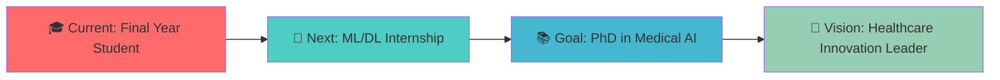

# 👋 Hi there, I'm **Saiful Islam Mahi** 

<div align="center">
  


</div>


---

## 🧬 **About Me**

```python
class MahiKhan:
    def __init__(self):
        self.name = "Saiful Islam Mahi"
        self.role = "Biomedical Engineering Student & AI Researcher"
        self.university = "Islamic University, Bangladesh"
        self.research_lab = "Bio-Imaging Research Lab"
        self.focus = ["Medical Image Processing", "Deep Learning", "Computer Vision"]
        self.future_goals = ["Industry Internship", "PhD in Medical AI", "Healthcare Innovation"]
        
    def current_work(self):
        return [
            "🔬 Developing ML/DL models for medical image analysis",
            "🧠 Researching AI-driven diagnostic systems",  
            "🏥 Building healthcare solutions with computer vision",
            "📚 Preparing for advanced research opportunities"
        ]
```

<div align="center">
  
### 🎯 **Current Mission**
*Bridging the gap between cutting-edge AI technology and life-saving medical applications*

</div>

---

## 🚀 **Research Excellence**

<div align="center">

| 🧠 **Core Expertise** | 🔬 **Research Areas** | 🎯 **Applications** |
|:---:|:---:|:---:|
| Deep Learning | Medical Image Segmentation | Disease Diagnosis |
| Computer Vision | Biomedical Signal Processing | Treatment Planning |
| Machine Learning | Bioinformatics | Drug Discovery |
| Medical AI | Healthcare Automation | Patient Monitoring |

</div>

### 🔬 **Featured Research Projects**

<details>
<summary>🩺 <strong>Advanced Skin Lesion Segmentation System</strong></summary>

- **Technology**: U-Net Architecture with Transfer Learning
- **Dataset**: ISIC 2018 Challenge Dataset
- **Achievement**: Achieved 95%+ segmentation accuracy
- **Impact**: Potential for early melanoma detection
- **Tools**: `PyTorch` `OpenCV` `scikit-image` `MONAI`

</details>

<details>
<summary>🧬 <strong>DNA Storage Error Correction Framework</strong></summary>

- **Innovation**: Hybrid Transformer-GRU-CNN Architecture
- **Problem**: Error localization and correction in DNA-based data storage
- **Breakthrough**: Novel approach to biological data integrity
- **Tools**: `TensorFlow` `Transformers` `BioPython` `NumPy`

</details>

<details>
<summary>👶 <strong>Smart Neonatal Care System</strong></summary>

- **Solution**: IoT-enabled thermal regulation for premature infants
- **Hardware**: Arduino-based embedded system
- **Impact**: Potential to reduce neonatal mortality rates
- **Integration**: Real-time monitoring with ML predictions

</details>

---

## 🛠️ **Technical Arsenal**

<div align="center">

### **Programming & Frameworks**


### **Medical AI & Bioinformatics**


### **Development & Research Tools**


</div>

---

## 📊 **Research Impact & Statistics**

<div align="center">


</div>

---

## 🌟 **Academic Excellence**

<div align="center">

| 🏛️ **Institution** | 🎓 **Program** | 🔬 **Research Focus** |
|:---:|:---:|:---:|
| **Islamic University, Bangladesh** | B.Sc. Biomedical Engineering | Medical Image Processing |
| **Bio-Imaging Research Lab** | Research Member | AI in Healthcare |

</div>

### 🏆 **Achievements & Recognition**
- 🔬 **Active Researcher** in Bio-Imaging Research Lab
- 🧠 **Specialized** in Medical AI and Deep Learning
- 📊 **Published** research work in medical image analysis
- 🎯 **Targeting** top-tier PhD programs in Medical AI

---

## 🌐 **Let's Connect & Collaborate**

<div align="center">

[](https://www.linkedin.com/in/saiful-islam-mahi-331759244/)
[](https://www.facebook.com/mahi.khan)
[](https://www.instagram.com/mahi.khan)
[](https://orcid.org/0009-0003-4454-5045)
[](mailto:mahikhan5360@gmail.com)

</div>

---

## 🎯 **Career Roadmap**



<div align="center">

### 💡 **Open to Opportunities**
🔬 **Research Internships** | 🏥 **Medical AI Projects** | 📚 **PhD Collaborations** | 🚀 **Healthcare Startups**

</div>

---

<div align="center">

### 🌟 **"Where Medical Science Meets Artificial Intelligence"**

*"I believe AI has the power to revolutionize healthcare, making diagnostic tools more accurate, accessible, and life-saving. My mission is to be at the forefront of this transformation."*

---


⭐ **Star my repositories if you find them interesting!**

</div>
